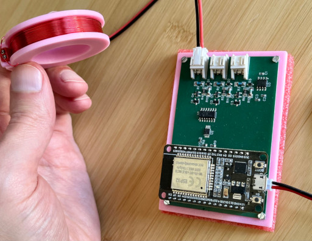

## Embedded software for ESP32 driven, bench powered PEMF device

This repo houses embedded software for an ESP32 driven PEMF prototype (Pulsed Electromagnetic Field therapy). This version employs custom electromagnets and PCB board with DAC, electromagnet ports, voltage-to-current opamp driver circuits, and header to attach a (KeeYees or compatible) 30-pin ESP32 dev board. After flashing the ESP32, it and the electromagnets are powered by 5V bench supply.

The ESP32 is commanded via WIFI, thus WIFI SSID and password must be set in [ProjectSettings.h](https://github.com/ajdonich/pemf-esp32/blob/main/include/ProjectSettings.h) prior to upload. The project employs Arduino libraries and [PlatformIO](https://platformio.org/) for build, upload and serial debug. Multiple main loop files are included in the repo for performing distinct functionality, but only one can be built/deployed at a time, which can be selected via the `build_src_filter` in [platformio.ini](https://github.com/ajdonich/pemf-esp32/blob/main/platformio.ini). The repo also contains a number of jupyter notebook servers for testing, however the device can also be driven by this [EMController](https://github.com/ajdonich/EMController) iPhone app.

